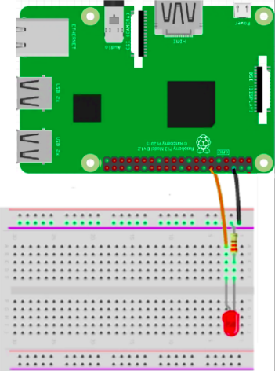

# LED Project

This project is part of the preseason training.  In this training you will wire an LED to the Raspberry Pi, write python code for the Raspberry Pi to control the LED, and create a robot project in java to use a button control to toggle the LED on/off using NetworkTables

## Connecting the LED

- You will be using a 330Ω resistor
- Resistors are a way of limiting the amount of electricity going through a circuit
- Connect black to pin 6 (ground)
- Connect yellow to pin 12 (GPIO 1)
- The LED has a long and short wire, short wire connects to the resistor

## Gamepad Controller
In this section we will learn the robot code structure.  
- Subsystems
- Commands
- Buttons/Triggers/Axis
Create the VSCode project
- Open VSCode and create a new project
    - Template
    - Java
    - Command Robot
- ExampleSubsystem.java
    - Controls a component of the robot
        - Drivetrain, Intake, Autonomous, etc ...
- ExampleCommand.java
    -Links the button to the subsystem
- Robot.java
    - Initialize the subsystem
- OI.java
    - OI is where the gamepad/joystick code goes
    - Enable the Joystick
    - Enable the Button	
        - Use DriverStation to find the button #
    - Enable the Command
        - Use whenPressed()
- ExampleCommand
    - Add method to toggle LED
    - Call the new method from execute()
- ExampleSubsystem
    - Add boolean to track state (on/off) for LED
    - Add NetworkTable stuff
        - NetworkTableInstance
        - NetworkTable
        - NetworkTableEntry
            ```java
            private NetworkTableInstance inst = NetworkTableInstance.getDefault();
            private NetworkTable table;
            private NetworkTableEntry myEntry;

            public ExampleSubsystem() {
                table = inst.getTable("LED");
                myEntry = table.getEntry("IsOn");
            }
            ```
 
    - Add toggle method
        - Change toggle value
        - Update NetworkTableEntry
            - setBoolean()

## Python LED Code
- Now control LED using the gamepad controller
    - Create python folder under src
    - Create new file called [led.py](src/main/python/led.py)
    - Read “isOn” from the “LED” table in the NetworkTable and toggle the led

``` python3
#!/usr/bin/env python3
import RPi.GPIO as GPIO
import sys
from networktables import NetworkTables

ip = sys.argv[1]
NetworkTables.initialize(server=ip)
led = NetworkTables.getTable("LED")

GPIO.setmode(GPIO.BOARD)
GPIO.setwarnings(False)
GPIO.setup(12,GPIO.OUT)

while True:
    isOn = bool(led.getBoolean("isOn", False))
    if isOn == True:
        print ("LED on")
        GPIO.output(12,GPIO.HIGH)
    else:
        print ("LED off")
        GPIO.output(12,GPIO.LOW)

GPIO.cleanup()  
```

